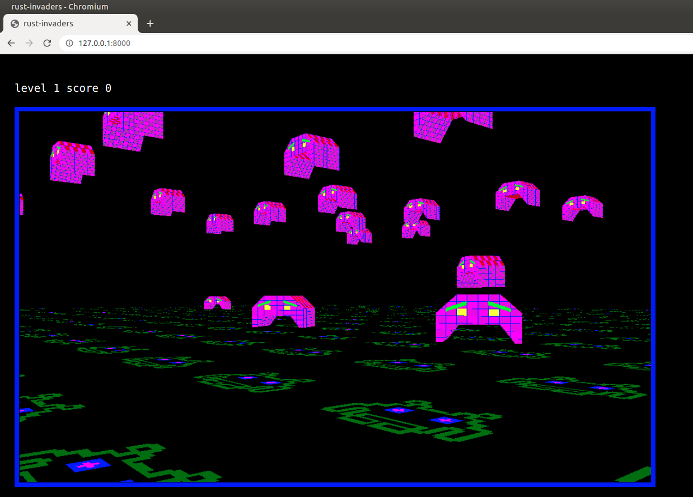

# Rust Invaders

A 3d rust game using OpenGl and Emscripten to build for the wasm32-unknown-emscripten.
It can also run standalone



standalone
```
cargo build
```

For web deployment
```
cargo build --target=wasm32-unknown-emscripten 
```

To try web locally
```
./run_wasm.sh
```